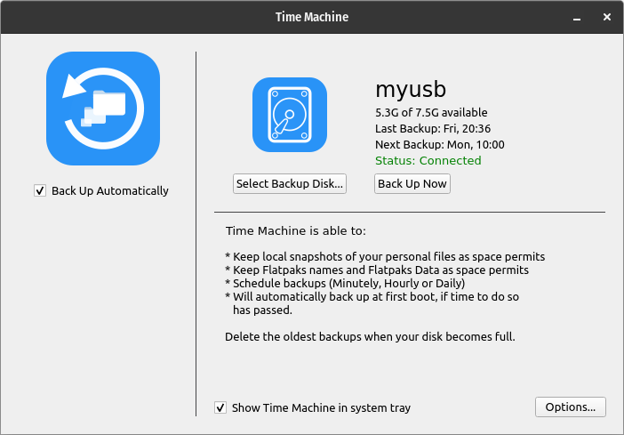
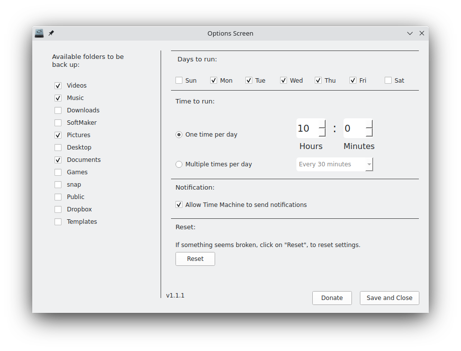
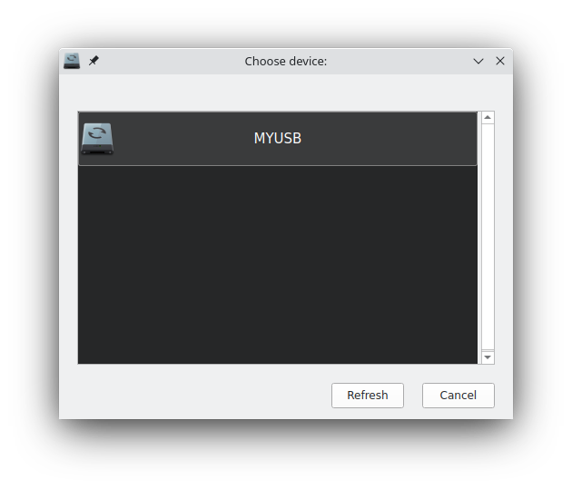

  
 <h1 align="center">Time Machine</h1>

Use Time Machine to automatically back up your personal data. 

Having a backup allows you to recover files that you later delete or can't access,
using "Enter Time Machine" mode.

## Attention!
* This project (Time Machine) is not affiliated with Apple. 
* This is a backup application created using PySide6 for Linux.
* Make sure that your clock method is "24 hour clock", not "12 hour clock" AM/PM.

## Know bugs:
* Unable to open Time Machine.
- This is something to do with "ConfigParser", this only happens when main window (Time Machine) is open. I think that happens when "main window" is try to write to INI file, sometimes, something goes wrong.

### Work around
- User need to copy "user.ini" from the download Time Machine or take a copy from the github and then, paste inside "/home/$USER/.local/share/timemachine/src/ini/user.ini".
Then, re-configure Time Machine again.

### Solution
I am still trying to fix this :D

## Support:
* Gnome -> Full support
* Kde -> Partial support

## Features:
* Local snapshots of your personal files, one or multiple times per day.
* Backup of your installed Flatpaks name and Data, so you can easily restore them.
* Will automatically delete the oldest backup, until has enough space for a new backup, but will keep at least one backup left. 
(The oldest backups are deleted when your backup disk is full.)

* Important: Time Machine does not back up system files!
* The first backup might take a long time, but you can continue using your PC while a backup is been made. 

#### Still not enough space for a new backup?
  Time Machine will alert you at Time Machine's main window, asking you to manually delete some file(s)/folder(s), so it can proceed with the backup.

## One Time Mode
* Hourly, Daily or Weekly backups
* Will automatically back up even if the schedule time to do so has passed.

## Multiple Time Mode
* Will automatically back up your files and apps every: 1, 2 or 4 hours.

Before a backup is made, Time Machine will analize and calculate your backup device full size, free space and space needed for Time Machine's next backup.

## Enter Time Machine
First, open Time Machine and allow to "show in the system tray".

Then, click on Time Machine in system tray and select "Enter Time Machine"
(Remember, will only work if Time Machine has made at least one backup already.)

Still in development...

## External drive connected to your PC
Time Machine can back up to an external drive connected to a USB, HD or SSD.

## Time Machine WILL NOT ERASE OR FORMAT YOUR EXTERNAL DEVICE! 
## Create a Time Machine backup
1. Connect an external storage device, such as a USB or HD/SSD.
2. Open Time Machine, click on "Select Backup Disk". This can also be done via system tray Time Machine, after enabled.
3. Then, click on "Back Up Now".

By now, Time Machine will backup:
* Your files and folders (If you choose to)
* Flatpaks installed names
* Flatpaks installed Data (If you choose to) - Not fully tested
* Wallpaper (Automatic, Only for Gnome) 
* Theme, Icon and cursor (Automatic, Only for Gnome)

#### Packages
* Inside of "Application" folder, in your backup device, you will find folders: "deb", "rpm" etc.
These folders was created, so you can manual put ".deb" or ".rpm" packages inside, to be easily restore with
Migration Assistant.

## Migration Assistant
A Welcome Screen is in development, something similar to Apple's "Migration Assistant", a easy way to restore your files/folders and apps, after a fresh install.

## System Tray 
You will notice that your system tray will from time to time change its color to White, Blue or Red.
* White = Normal color, automatically backup is ON and your backup device is connected and mounted.
* Blue = Time Machine is current backing your files, after is done, it will changes to White color.
* Red = If automatically backup is ON but your backup device is disconnected or not mounted, you will see a Red system tray icon.
  - Red system tray icon can also mean that Time Machine had some problem to back up. Open Time Machine main window and read the report about it.

## Requirements
* pyside6

## Installation:
You will be asked for your password.
* Copy and paste this command bellow to the terminal.

Example:

    git clone -b main https://github.com/geovanejefferson/timemachine; cd timemachine/; python3 install.py

## Uninstall:
Command:

    cd .local/share/timemachine/; python3 uninstall.py

## Screenshots:

