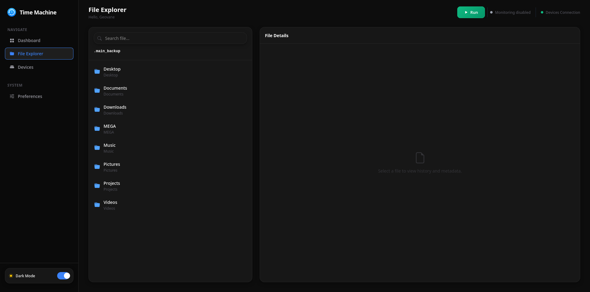
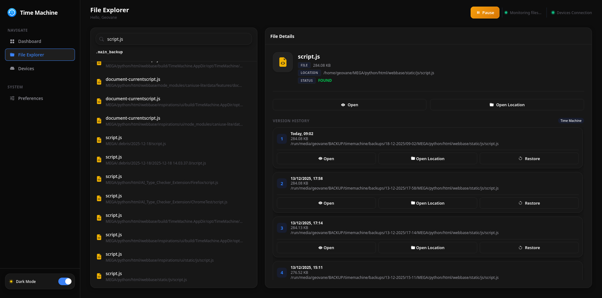
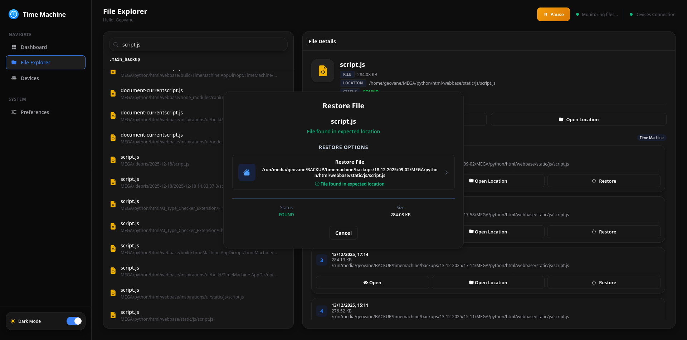
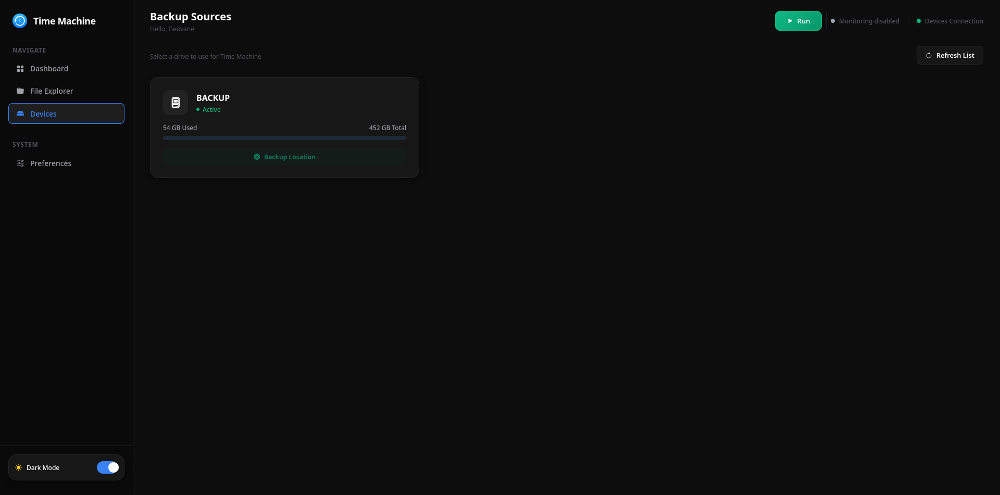
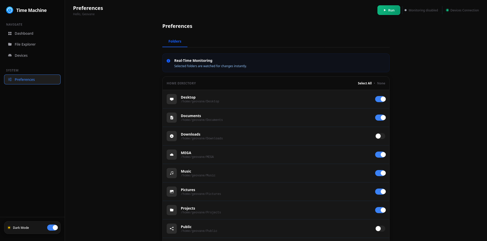

# 🚀 TimeMachine Backup for Linux

**A real-time backup solution for Linux** that provides automated, incremental file backup and synchronization via a responsive web-based interface. Monitors your files continuously and backs them up instantly as they change. Tested and optimized on Fedora Linux.

[](https://python.org)
[](https://flask.palletsprojects.com/)
[](https://www.linux.org/)
[](https://github.com/GeovaneJefferson/timemachine)
[](LICENSE)

## ✨ Features

| Component | Feature | Description |
|-----------|---------|-------------|
| **Real-time Backup** | Instant File Monitoring | Uses `watchdog` to detect file changes immediately and back them up as they happen |
| **Interface** | Modern Web UI | Responsive interface built with HTML/CSS and Tailwind CSS |
| **Backend** | Python & Flask | Robust backend handling all logic and device management |
| **Backup** | Automated & Incremental | Continuous background monitoring, only copies changed files |
| **Optimization** | Hardlink Optimization | Reuses file data on backup target to save space |
| **Tracking** | Hash-based File Tracking | Track files across moves and renames using content hashes |
| **Flexibility** | Storage Management | Easy management of external backup storage devices |

## 📸 Screenshots

| **Main Dashboard** |  |
| **File Restore** |  |
| **File Restore** |  |
| **File Restore** |  |
| **Device Management** |  |
| **Backup Settings** |  |

## ⚡ Quick Start

### Prerequisites
- Python 3.7+
- Linux system (tested on Fedora)

### Installation

```bash
# Clone the repository
git clone [https://github.com/GeovaneJefferson/timemachine.git](https://github.com/GeovaneJefferson/timemachine.git)
cd timemachine

# Install dependencies
pip install -r requirements.txt
```

### Running the Application

#### Method 1: Full Web Interface
```bash
# Start the server
python3 app.py
```
Then open your browser to `http://localhost:5000` and follow the setup wizard.

#### Method 2: Headless Daemon Only
```bash
## ⚠️ Important Notes

# Real-time Backup Operation
Important Note: You must launch the Web Interface at least once (python3 app.py) to choose a backup device and folders before using this method.

# Run just the real-time backup daemon
python3 daemon.py
```
This starts the real-time monitoring without the web interface.

## 🔧 Architecture

### Project Structure
```
timemachine/
├── config/              # Configuration Files
├── static/              # Web assets (CSS, JS, images)
├── templates/           # HTML templates
├── app.py               # Flask application (Web Interface)
├── daemon.py            # Core Backup Daemon (Real-time monitoring engine)
├── server.py            # Shared server functionality
├── search_handler.py    # File search logic
├── storage_util.py      # Storage device detection
├── daemon_control.py    # Daemon management
├── .gitignore
└── requirements.txt
```

### Real-time Backup Engine
TimeMachine uses `watchdog` to monitor filesystem events in real-time:
- **Instant detection** of file changes, creations, and deletions
- **Event-driven architecture** for minimal CPU usage
- **Incremental backup** - only changed files are copied
- **Continuous operation** - runs 24/7 in background

### Why Flask?
- **Clean Architecture**: Clear separation of UI from core engine
- **Rapid Development**: Quick iteration without complex native toolkits
- **Remote Access**: Potential for network-based management
- **Learning Platform**: Modern web application patterns
- **Personal Learning**: I know electron is not the best choose for app, but i wanted to learn a new framework. If i can enough support, may upgrade to Gtk4 or Qt6.

## ⚠️ Important Notes

### Real-time Backup Operation
- **Continuous Monitoring**: Once started, TimeMachine runs continuously in background
- **Immediate Backup**: File changes are backed up within seconds of being saved
- **Immediate Backup v2**: Countdown for a faster changed files of 1 min.
- **Low Resource**: Efficient monitoring with minimal system impact
- **In Development!**: Many things may change in the future

### Daemon Auto-Start (Not Implemented)
**After every system reboot, you must manually restart the daemon by:**
1. Running `python3 app.py` and using the web interface
2. Opening `http://localhost:5000`
3. Clicking the "Run" button
4. Or simply running `python3 daemon.py` directly in terminal

### System Compatibility
Designed and tested for Linux systems, primarily Fedora. Other distributions may require adjustments.

## 🛣️ Roadmap

### High Priority
- [ ] Auto startup on boot

### Medium Priority
- [ ] Native UI integration (GTK4/Qt6)
- [ ] System tray icon
- [ ] Desktop notifications for backup events

### Low Priority
- [ ] Remote management
- [ ] Multiple backup targets
- [ ] Backup encryption

## 🐛 Troubleshooting

### Common Issues
1. **"Permission denied" errors**
   - Ensure write access to backup target
   - Use appropriate permissions for system folders

2. **Daemon not starting**
   - Verify Python dependencies are installed
   - Run daemon.py in terminal, chceck for errors

3. **Device not detected**
   - Ensure storage device is properly mounted
   - Check USB connection if using external drive

### Performance Tips
- **Use SSD** for backup target for faster operations

## 📄 License

This project is licensed under the MIT License - see the LICENSE file for details.
