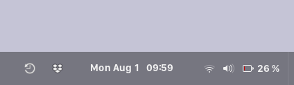

# Attention!
* This project (Time Machine) is not affiliated with Apple. 
* This is a backup application created using PySide6 for Linux.
* Make sure that your clock method is "24 hour clock", not "12 hour clock" AM/PM.

# Time Machine
Use Time Machine to automatically back up your personal data. 

Having a backup allows you to recover files that you later delete or can't access.
using "Enter Time Machine" mode.

## Features:
* Local snapshots of your personal files, one or multiple times per day.
* Snapshots of your installed Flatpaks name and Data, so you can easily restore them.
* "Enter Time Machine" Still in development...
* Will automatically back up at first boot, if time to do so has passed.
* Will automatically delete the oldest backup, until has enough space for a new backup, but will keep at least one backup left. 
(The oldest backups are deleted when your backup disk is full.)
* Important: Time Machine does not back up system files!

#### Still not enough space for a new backup?
  Time Machine will send you a notification, asking you to manually delete some file(s)/folder(s), so it can proceed with the backup.

## Behind the "scenes":
On the main Time Machine's window, will show base information about your backup HD/SSD device.
Such as: 
* Backup HD/SSD Name
* Free space of the backup HD/SSD
* When last backup was made
* When the next backup will occur
* Device connectivity

Before a backup is made, Time Machine will analize and calculate your backup HD/SSD full size, free space and space needed for Time Machine's next backup.

## Create a Time Machine backup
1. Connect an external storage device, such as a USB or HD/SSD.
2. Open Time Machine, click on "Select Backup Disk". This can also be done via system tray Time Machine, after enabled.
3. Then, click on "Back Up Now".

## Enter Time Machine
First, open Time Machine and allow to show in the system tray.

Then, click on Time Machine in system tray and select "Enter Time Machine"
(Remember, will only work if Time Machine has made at least one backup already.)

Still in development...

## Migration Assistant
A Welcome Screen is in development, something similar to Apple's "Migration Assistant", a easy way to restore your files/folders and apps, after a fresh install.

#### Welcome Screen
* Will ask you to select a Time Machine HD/SSD that already has a backup inside.
* Will ask if you want to "Restore" or "Set Up as New".
* Will ask you to choose which information you'd like to restore.

After Welcome Screen is done, all your recent files, folders and Flatpaks are automatically restore and installed.

## Requirements
* pyside6

## Installation:
You will be asked for your password.
* Copy and paste this command bellow to the terminal.

Example:

    git clone -b main https://github.com/geovanejefferson/timemachine; cd timemachine/; python3 install.py

## Uninstall:
Inside Time Machine folder, right click, "open terminal", write "python3 uninstall.py" and press Enter.

Example:

    python3 uninstall.py

## Screenshots:

