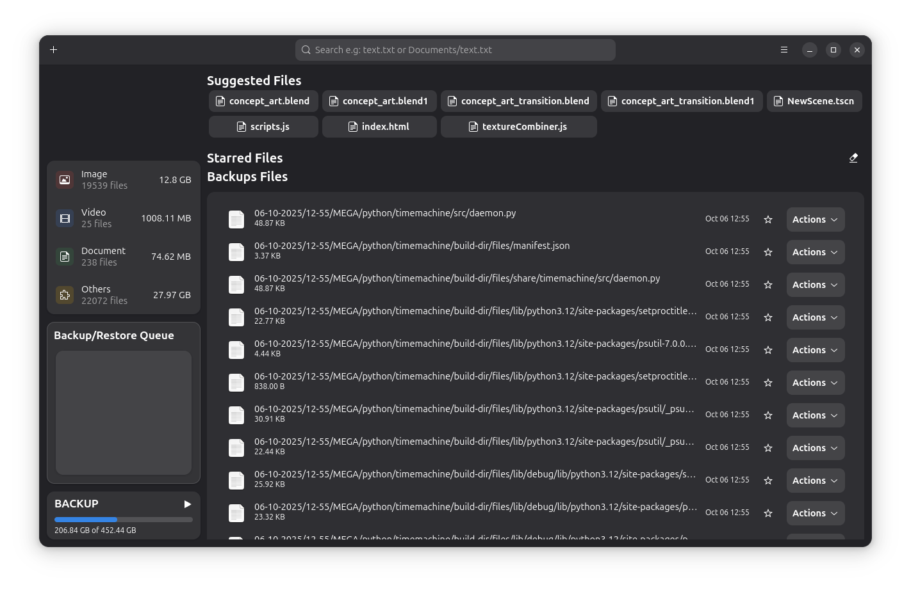
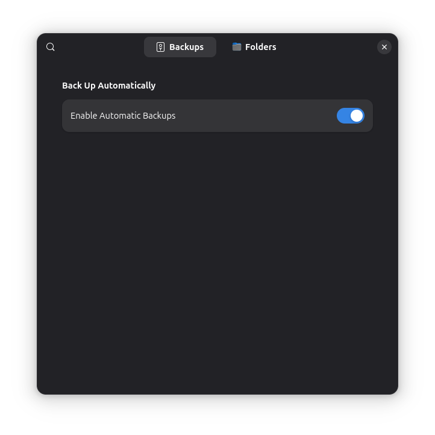
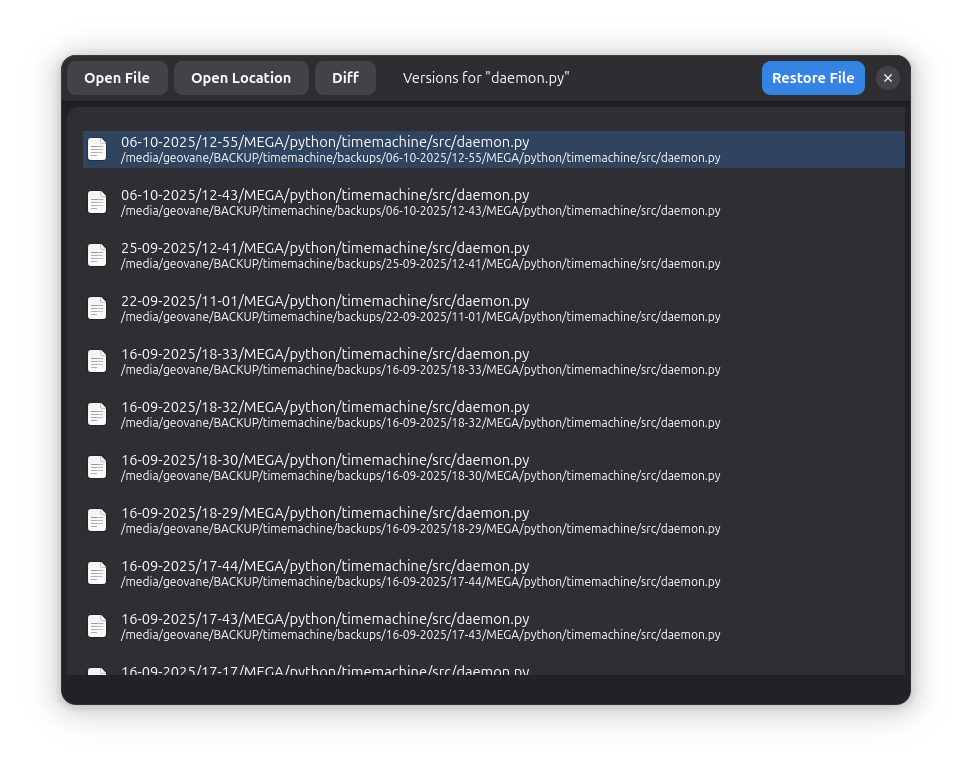

<<<<<<< HEAD
# Time Machine 🛡️
=======
# Time Machine 🛡️ (GTK4 OLD CODE)
>>>>>>> 61b5794 (Git push)

**Your personal, vigilant backup assistant for Linux desktops.**

Time Machine is a Python-based backup solution designed to safeguard your important files, settings, and applications on Linux desktops. It operates through a powerful daemon and a user-friendly GTK4-based GUI, offering a comprehensive and reliable data protection experience.

---

⚠️ **Under Development:** Please note that Time Machine is currently under active development. While it offers many features, it may still contain bugs or undergo significant changes. Use with caution, especially for critical data!

---

## ✨ Screenshots





---

## Core Features

### Daemon Features

The daemon, the core of Time Machine, silently works in the background to manage your backups:

*   **Automatic Backups:** Runs at regular intervals to check for new or changed files.
*   **Intelligent File Scanning:** Uses metadata caching for quick folder checks and SHA-256 hashing for precise file change detection.
*   **Incremental Backups:** Creates a full initial backup, then saves only changes in timestamped increments, saving space.
*   **Robust File Copying:** Employs atomic file operations, preserves metadata, and adjusts copy concurrency based on system load.
*   **Interruption Handling:** Resumes interrupted backup processes intelligently.
*   **Disk Space Management:** Checks backup drive space before starting.
*   **Automatic Package Backup:** Backs up downloaded `.deb` and `.rpm` packages.
*   **Backup Drive Monitoring:** Ensures the backup drive is connected and writable.
*   **System Signal Handling:** Gracefully handles system signals (terminate, interrupt, pause, resume).
*   **Detailed Logging:** Logs all significant actions and errors.
*   **UI Communication:** Sends real-time status and progress to the GUI via a socket.
*   **Single Instance Guarantee:** Prevents multiple daemon instances from running.
*   **Configurable Exclusions:** Allows excluding specific folders, hidden files/folders, or by file extensions.

### GUI Features

The GTK4-based graphical user interface (GUI) provides an intuitive way to interact with Time Machine:

*   **Device Selection:** Easily select your external drive for backups.
*   **Real-time Monitoring:** Displays daemon status, current scanning folder, and file transfer progress.
*   **Configuration Options:** Manage automatic backups, excluded folders/files, and other settings.
*   **File Browsing and Search:** Navigate and search within your backups.
*   **File Restoration:** Restore individual files or entire directories.
*   **Visual Overviews:** View backup summary statistics (file categories, frequent files).
*   **Suggested Files:** Recommends files for backup based on usage patterns.
*   **Starred Files:** Mark important backed-up files for quick access.
*   **System Restore:** Restore applications (.deb/.rpm), files/folders, and Flatpaks.
*   **Logging Access:** View daemon logs directly from the GUI.
*   **Diff Viewing:** Compare different backed-up versions of text files against the current version in your home directory.

---

## 🛠️ Tech Stack

*   **Python 3**
*   **GTK4 & Libadwaita:** Native Linux desktop UI.
*   **Asyncio & `concurrent.futures.ThreadPoolExecutor`:** Efficient, non-blocking operations and parallel file copying for the daemon.
*   **Standard Libraries:** `os`, `shutil`, `hashlib`, `json`, `logging`, `signal`, `tempfile`, `socket`, `configparser`, `datetime`, `subprocess`, `psutil`, etc.
*   **Third-party:** `setproctitle` for daemon process naming.

---

## 🚀 Getting Started

### Prerequisites

*   Python 3.8+
*   GTK4 & Libadwaita (e.g., `gir1.2-gtk-4.0`, `libadwaita-1-0` on Debian/Ubuntu based systems)
*   Python GObject bindings (`python3-gi`, `python3-gi-cairo`)
*   `psutil` (install with `pip install psutil`)
*   `setproctitle` (install with `pip install setproctitle`)

### Install from Source (for Development)

This is the recommended method for development and local testing.

1.  **Clone the repository:**
    ```bash
    git clone https://github.com/geovanejefferson/timemachine.git
    cd timemachine
    ```

2.  **Install with flatpak builder:**
    ```bash
    flatpak-builder --user --install --force-clean build-dir io.github.geovanejefferson.timemachine.yaml
    ```

### Update from Source (for Development)

This is the recommended method for development and local testing.

1.  **Clone the repository:**
    ```bash
    git clone https://github.com/geovanejefferson/timemachine.git
    cd timemachine
    ```
    
2.  **Update with flatpak builder:**
    ```bash
    flatpak-builder --user --install --force-clean build-dir io.github.geovanejefferson.timemachine.yaml
    ```

### To Remove
1.  **Remove with flatpak:**
    ```bash
    flatpak remove io.github.geovanejefferson.timemachine -y
    ```

2.  **Delete the directory:**
    ```bash
    rm -rf /home/$USER/.var/app/io.github.geovanejefferson.timemachine
    ```
    
## 📋 TODO
1. Publish flatpak to Flathub.
2. Add remotely backup ability. (Network Transfer)
3. Redo UI.
